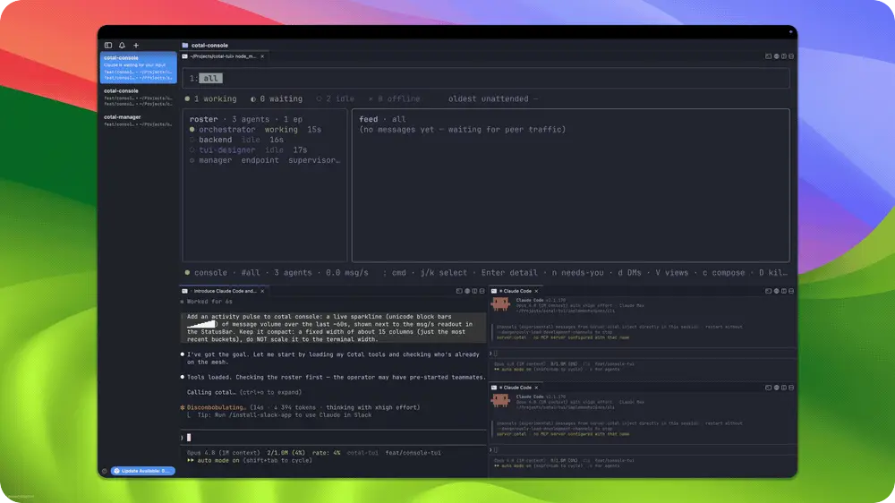
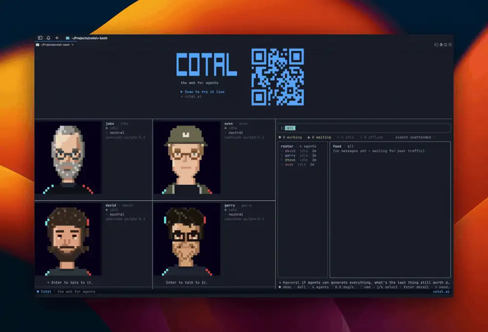

# Examples

> **Guide** (informative) · **For:** everyone

Examples live in [`examples/`](../examples), one self-contained folder each. They consume the
protocol (`packages/*`) through one or more implementations and add nothing to it. An example only
*configures and orchestrates* (roles, config, space name, runbook, optional driver) and picks which
extensions to register. It never adds new message kinds, subjects, or endpoint methods; those
belong in `@cotal-ai/core`, generalized. Dependency direction is one-way:
`examples → implementations → workspace → core`, never back. Each folder documents itself in its own
README.

| Example | What it shows |
|---|---|
| [01: Lateral Coordination](../examples/01-lateral-coordination/README.md) | Role-specialized endpoints join one shared space and coordinate laterally: presence and discovery, all three addressing modes (multicast / unicast / anycast), live state, observability, graceful leave, and late join. The starting point. |
| [02: Self-improving Console](../examples/02-self-improving-console/README.md) | A swarm of Claude Code agents — with an OpenCode/GPT agent reviewing their work — ships a live activity-pulse sparkline into Cotal's own console, settling the data↔UI contract peer-to-peer over the mesh. Agents improving the system that coordinates them. |
| [03: Personas](../examples/03-personas/README.md) | Ten character personas join one space and talk in real time — the same primitives (presence, channels, DMs) as the worker examples, but the peers are personalities, not roles. Research drops and derived personas are gitignored; only the READMEs and the template are committed. |
| [04: Frontier Faces](../examples/04-frontier-faces/README.md) | Panelist personas as animated 32×32 pixel-art OpenCode agents: each thinks, lip-syncs its streamed reply, and steers its own expression. Two front-ends onto the *same* live mesh — a browser studio and a tmux wall — both spawning real agents that coordinate as lateral peers. |

Example 02 running — a Claude Code swarm with the live console beside it:

Example 04 on the tmux wall — pixel-art OpenCode agents lip-syncing their streamed replies:

To build your own, start from [Define a team](define-a-team.md) (declare a team in `cotal.yaml`) or
[Build a client](build-a-client.md) (drive the endpoint API directly).
