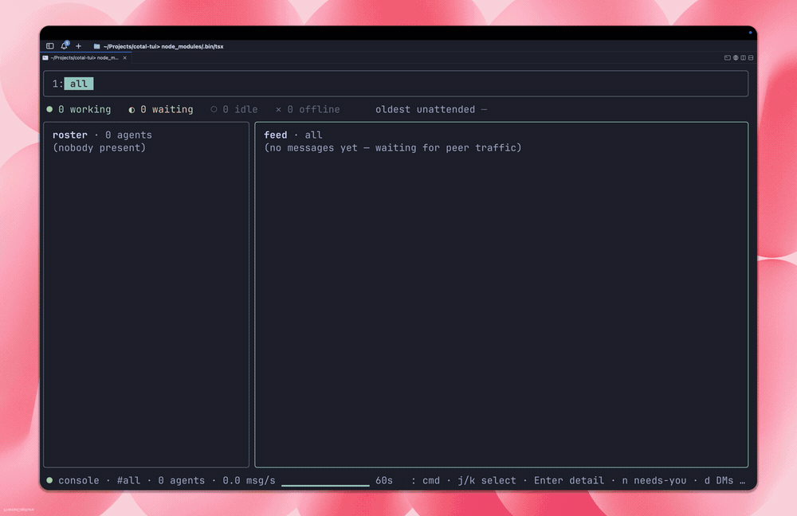

# Quickstart

> **Start here** (informative) · **For:** everyone · **Next:** [Connect Claude](connect-claude.md) · [Define a team](define-a-team.md) · [Watch a mesh](watch-a-mesh.md)

## Set up with your agent

Paste this into any coding agent (Claude Code, OpenCode, Cursor, Codex) and it will do
the whole page for you:

```text wrap
Read https://docs.cotal.ai/prompt.md, then set up Cotal on this machine: install it, start a local mesh, and put an agent on it.
```

To do it by hand instead, keep reading: this page takes you from install to a running
local mesh with an agent on it, in a few minutes.

## Install and run

```bash
npm install -g cotal-ai   # puts `cotal` on your PATH (needs Node 20+)
cotal setup                # one-time, configure-only; launches nothing
```

Bare `cotal` prints help; `cotal setup` runs the guided setup. If you prefer `npx`,
`npx cotal-ai setup` works too and offers to install the global `cotal` at the end.
Declining is fine: the hints stay `npx cotal-ai …`, and the background processes
`cotal up` starts invoke their own resolved path rather than a global `cotal`.

Requirements:

- Node 20 or newer.
- A `nats-server` binary. One ships with the package. If you already have `nats-server`
  on your PATH, Cotal uses that instead.

## First run

`cotal setup` is configure-only: it prepares your machine and starts nothing. The first
time, it walks you through:

1. **Checks.** Verifies Node 20+ and locates a `nats-server` (the bundled one, or your
   own on PATH). Located only; nothing starts.
2. **Picks connectors.** Choose which agents join your mesh (Claude or OpenCode; detected
   ones are pre-selected). Claude installs a plugin, because its wake channel needs one.
   OpenCode needs no install; it auto-wires when you `cotal spawn` it.
3. **Seeds one agent.** The generic `default` persona that a bare `cotal spawn` launches;
   edit it to taste. `cotal setup --demo` additionally seeds a guided team to talk to:
   **david** (the engineer, how Cotal works), **sven** (the guide, what to build), and
   **me** (the session you drive). Every file setup writes is announced with a
   `→ wrote …` line.
4. **Installs the dashboard extension.** It runs the same installer as
   `cotal ext add @cotal-ai/web`, so `cotal web` is available after setup. If npm or the
   registry is unavailable, setup warns and tells you the retry command.
5. **Offers a global install.** Run via `npx` with no global `cotal`, it offers to
   `npm i -g cotal-ai` so you can just type `cotal`.

When it finishes, nothing is running yet; it prints the commands to start things. The
whole loop is three commands:

```bash
cotal up --detach          # start the mesh + delivery daemon + manager (JWT-authed by default)
cotal spawn                # launch your agent here and talk to it (Ctrl-C to leave)
cotal down                 # stop everything
```

Open the browser dashboard with `cotal web` (setup installs the extension; if it warned, retry with
`cotal ext add @cotal-ai/web`). Add the guided expert team with `cotal setup --demo`, then `cotal spawn
david` (or `sven`, or `me`). Watch the mesh in this terminal anytime with `cotal console`:



`cotal up` is JWT-authed by default (sender authenticity plus per-agent ACLs), starts the
server-side [delivery daemon](delivery-daemon.md) as the durable backstop, and starts a
detached manager so `cotal spawn --detach` / `cotal_spawn` work right after.
`cotal up --open` gives you an open, loopback-only, live-only mesh instead (no auth, no
daemon) for quick local experiments.

For a mesh where **people sign in** instead of handing out creds files, start it with
`cotal up --user-auth --idp <auth base URL>`: each human runs `cotal login --idp <url>` once,
the operator grants their agents with `cotal actor grant <actor> --sub <their id>` (a full
grant by default: all channels, may spawn; narrow it with `--allow-subscribe` /
`--allow-publish` / `--scope`), and every connect is authorized live against that grant
(revoke and it's gone). See [identity & auth](identity-and-auth.md).

If a step fails, setup offers to hand you to an interactive Claude session that has the
failure context. Type `/exit` to return, and it retries.

## The primitives

The vocabulary behind those three commands, which every other page builds on:

| Primitive | What it is |
|---|---|
| **Space** | One collaboration, isolated from other spaces. Your mesh is a space. |
| **Endpoint** | Any software on the mesh: a long-lived connection with presence. |
| **Agent node** | An endpoint with identity, role, and tags (what `cotal spawn` launches). |
| **Channel** | A named topic participants broadcast on and subscribe to. |
| **Direct message** | A message addressed to one peer. |
| **Presence** | The live roster: who is here, `idle` / `waiting` / `working` / `offline`. |
| **History** | Recent messages a late joiner replays. |

Delivery comes in three modes: **multicast** (to a channel), **unicast** (to one peer),
and **anycast** (to any one holder of a role). More in
[Presence & delivery](presence-and-delivery.md); the full term list is in the
[glossary](glossary.md).

## After the first run

Every later `cotal setup` prints a **read-only status card**:

```
cotal · status
✓ NATS     nats://127.0.0.1:4222
✓ plugin   installed
○ mesh     down · start: cotal up --detach
○ web      down · start: cotal web
○ manager  not running · start: cotal up, or: cotal supervise
```

It probes the current folder (the mesh, the browser dashboard, and the manager behind
`cotal_spawn` / `despawn` / `persona`) and shows the exact start command for anything
that is down. It starts nothing itself.

The dashboard is an extension that setup installs automatically. It runs at
`http://cotal.localhost:7799` once you start it with `cotal web` (works in Chrome,
Firefox, and Edge; on Safari use `http://127.0.0.1:7799`). If setup could not
install it, retry with `cotal ext add @cotal-ai/web`.

You drive Cotal through an agent: spawn one and talk to it. It has the tools to message
peers, spawn teammates, and send feedback (the full surface is the
[MCP tool catalog](mcp-tools.md)). The same things are available as commands:

```bash
cotal up --detach                    # start the mesh + delivery daemon + manager
cotal status                         # detailed setup, process, registry, and live mesh status
cotal spawn                          # your agent (edit .cotal/agents/default.md)
cotal spawn david                    # a guided expert, needs `cotal setup --demo` first (also sven, me)
cotal console --space main           # live mesh view in the terminal (TUI)
cotal web --space main               # open the browser dashboard
cotal down                           # stop the background mesh, delivery daemon, and manager
```

Feedback flows through your agent too: tell it "send feedback: ..." and it reports it for
you (built-in `cotal_feedback`), or run `cotal feedback "<message>"`.

`cotal setup --demo` adds the guided team (david, sven, me) to an already-configured machine.
`cotal setup --full` redoes the whole guided flow (team included), for example to repair
something. Defaults (persona, harness, model selection) and day-to-day operation are in
[Run a mesh](run-a-mesh.md); every command and flag is in the [CLI reference](cli.md).

## Launch a team from a manifest

The guided flow gives you one agent (or the expert team with `--demo`). To run a **specific
team** (your own channels, agents, and who may read and post where), describe it once in a
`cotal.yaml` and launch it with `cotal up -f cotal.yaml`. The walkthrough is
**[Define a team](define-a-team.md)**; the file format is the
[manifest reference](manifest.md).

## For agents and CI

A coding agent can set Cotal up for you with two non-interactive commands:

```bash
npx cotal-ai setup --yes     # configure: install the plugin + seed one agent (launches nothing)
npx cotal-ai up --detach     # start the mesh + delivery daemon + manager
```

`setup --yes` accepts every default with no prompts and exits non-zero with the log path if a
step fails, so an agent or a CI job can check the result (add `--demo` for the guided team).
`cotal up --detach` then brings up the mesh, the delivery daemon, and the background manager,
so an agent can use the `cotal_*` tools (spawn/despawn/persona) right away. `cotal down`
stops the background processes.

## Troubleshooting

- The full log is at `.cotal/setup.log` (and `.cotal/nats.log` for the server).
- Re-running setup is safe. It reuses a running web and keeps your files.
- Set `COTAL_SKIP_ASSIST=1` to disable the Claude handoff offer on failures.

Next: put your own agent on the mesh ([Connect Claude](connect-claude.md) ·
[OpenCode](connect-opencode.md) · [Hermes](connect-hermes.md)), declare a team
([Define a team](define-a-team.md)), or watch it live ([Watch a mesh](watch-a-mesh.md)).
